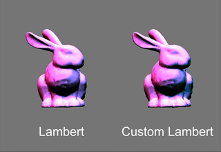

# udemy_shaderdev
Shaders from Udemy's Shader Development from Scratch for Unity with Cg course

## Lesson 25. Rim Lighting

Shader code [HolisticRim.shader](HolisticRim.shader)

 

## Lesson 26. Logical Cutoffs

Shader code [HolisticRimCutoffOutlines.shader](HolisticRimCutoffOutlines.shader)

 

Shader code [HolisticRimCutoffStripes.shader](HolisticRimCutoffStripes.shader)

 

## Lesson 29. Blinn-Phong Lighting & Surface Output

Shader code [HolisticBasicLambert.shader](HolisticBasicLambert.shader)

Shader code [HolisticBasicBlinn.shader](HolisticBasicBlinn.shader)

 

## Lesson 30. Physically-Based Rendering

Shader code [HolisticStandartPBR.shader](HolisticStandartPBR.shader)

Shader code [HolisticStandartPBRSpec.shader](HolisticStandartPBRSpec.shader)

 

## Lesson 33. Writing Your Own Lighting Model

Shader code [HolisticCustomLambertLighting.shader](HolisticCustomLambertLighting.shader)

 

Shader code [HolisticCustomBlinnLighting.shader](HolisticCustomBlinnLighting.shader)

 

Shader code [HolisticCustomRampLighting.shader](HolisticCustomRampLighting.shader)

 
