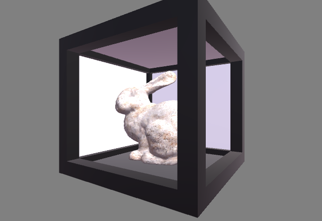
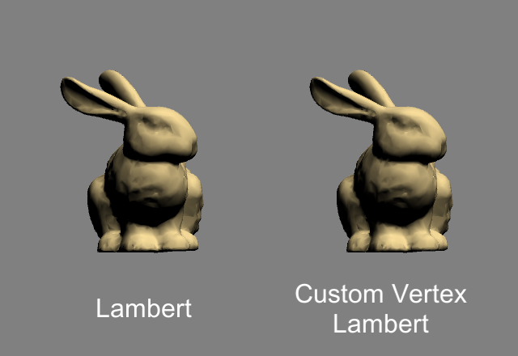

# udemy_shaderdev
Shaders from Udemy's Shader Development from Scratch for Unity with Cg course

## Lesson 25. Rim Lighting

Shader code [HolisticRim.shader](HolisticRim.shader)

 

## Lesson 26. Logical Cutoffs

Shader code [HolisticRimCutoffOutlines.shader](HolisticRimCutoffOutlines.shader)

 

Shader code [HolisticRimCutoffStripes.shader](HolisticRimCutoffStripes.shader)

 

## Lesson 29. Blinn-Phong Lighting & Surface Output

Shader code [HolisticBasicLambert.shader](HolisticBasicLambert.shader)

Shader code [HolisticBasicBlinn.shader](HolisticBasicBlinn.shader)

 

## Lesson 30. Physically-Based Rendering

Shader code [HolisticStandartPBR.shader](HolisticStandartPBR.shader)

Shader code [HolisticStandartPBRSpec.shader](HolisticStandartPBRSpec.shader)

 

## Lesson 33. Writing Your Own Lighting Model

Shader code [HolisticCustomLambertLighting.shader](HolisticCustomLambertLighting.shader)

 

Shader code [HolisticCustomBlinnLighting.shader](HolisticCustomBlinnLighting.shader)

 

Shader code [HolisticCustomRampLighting.shader](HolisticCustomRampLighting.shader)

 

## Lesson 36. The Alpha Channel

Shader code [HolisticBasicLambertAlpha.shader](HolisticBasicLambertAlpha.shader)

 

## Lesson 37. Holograms

Shader code [HolisticHologram.shader](HolisticHologram.shader)

 

## Lesson 38. Blending

Shader code [HolisticAlphaBlendOneOne.shader](HolisticAlphaBlendOneOne.shader)

 

## Lesson 39. Leaves and Culling

Shader code [HolisticTransparentCullOff.shader](HolisticTransparentCullOff.shader)

 

## Lesson 40. Blending Two Images

Shader code [HolisticBasicTextureDecal.shader](HolisticBasicTextureDecal.shader)

 

## Lesson 41. Stencil Buffer

Shader code [HolisticStencilHole.shader](HolisticStencilHole.shader)

Shader code [HolisticStencilBasicLambert.shader](HolisticStencilBasicLambert.shader)

 

## Lesson 42. Advanced Stencils

Shader code [HolisticStencilHole.shader](HolisticStencilHole.shader)

Shader code [HolisticStencilBasicLambert.shader](HolisticStencilBasicLambert.shader)

 

## Lesson 44. Colouring by Vertices and Fragments

Shader code [HolisticColorVertexGradient.shader](HolisticColorVertexGradient.shader)

Shader code [HolisticColorFragmentGradient.shader](HolisticColorFragmentGradient.shader)

 

## Lesson 45. Material Use

Shader code [HolisticGrabPassSinUV.shader](HolisticGrabPassSinUV.shader)

 

## Lesson 46. Lighting

Shader code [HolisticCustomVertexLambert.shader](HolisticCustomVertexLambert.shader)

 

## Lesson 47. Shadows

Shader code [HolisticVFDiffuseShadow.shader](HolisticVFDiffuseShadow.shader)

 

## Lesson 48. Challenge 1 

Shader code [HolisticVFTextureVertexColor.shader](HolisticVFTextureVertexColor.shader)

Shader code [HolisticVFVertexCoordColor.shader](HolisticVFVertexCoordColor.shader)

 

## Lesson 49. Challenge 2

Shader code [HolisticVFDiffuseShadowRed.shader](HolisticVFDiffuseShadowRed.shader)

 

## Lesson 50. Vertex Extruding

Shader code [HolisticExtrude.shader](HolisticExtrude.shader)

 

## Lesson 51. Outlining

Shader code [HolisticSimpleOutline.shader](HolisticSimpleOutline.shader)
Shader code [HolisticAdvancedOutline.shader](HolisticAdvancedOutline.shader)

 

## Lesson 52. Glass

Shader code [HolisticGlass.shader](HolisticGlass.shader)

 

## Lesson 53. Waves

Shader code [HolisticWaves.shader](HolisticWaves.shader)

 

## Lesson 54. Scrolling Textures 

Shader code [HolisticScrollUV.shader](HolisticScrollUV.shader)

 

## Lesson 55. Challenge 1

Shader code [HolisticWaveScroll.shader](HolisticWaveScroll.shader)

 